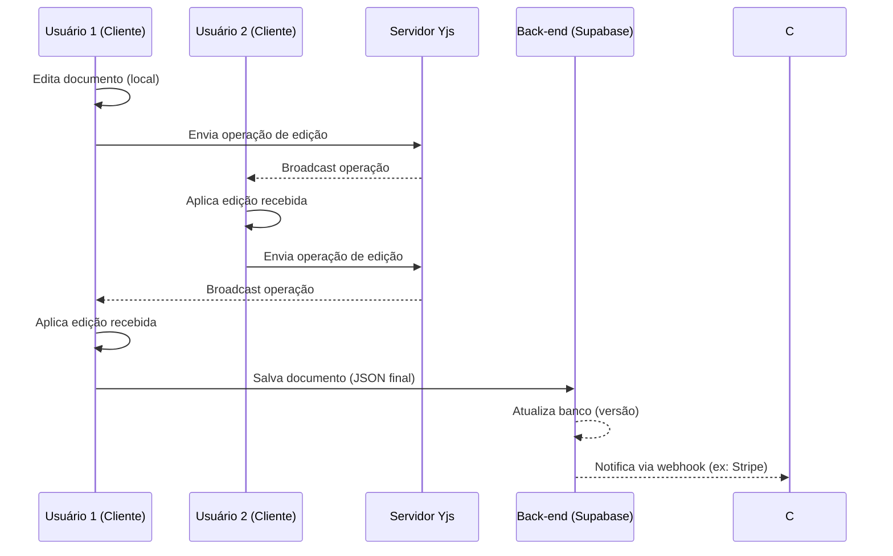

# Resumo Executivo

Este relatório analisa detalhadamente as necessidades técnicas para construir o **Editja**, um editor de documentos web completo, comparável em recursos ao Microsoft Word, mas focado em templates JSON customizados. Abrange funcionalidades principais de usuários (formatação de texto, estilos, cabeçalhos, rodapés, tabelas, imagens, gráficos, notas de rodapé, sumário, índice, mala direta, galeria de templates, import/export de formatos, etc.), **formatos suportados** (DOCX, ODT, PDF, HTML, RTF, texto simples, imagens, JSON de templates), **colaboração em tempo real** (OT vs CRDT, presença, cursores, resolução de conflitos), **arquitetura do editor** (renderização cliente, uso de Fabric.js, modelo de documento, undo/redo, performance), **serviços backend** (armazenamento, versionamento, diffs, conversão de formatos, busca/índice, autenticação, permissões, cobrança), **modelo de dados** (esquema JSON dos templates, metadados, revisões, links compartilhados), **integrações e APIs** (Office/Google, geração de PDF, edição de imagens, fontes/licenciamento), **segurança e conformidade** (criptografia em trânsito/em repouso, controle de acesso, LGPD/GDPR), **testes e acessibilidade** (WCAG), **implantação/infraestrutura** (Supabase, Netlify ou alternativas, CDN), **bibliotecas e ferramentas** (motores rich-text, conversores, libs CRDT/OT) e **UX/UI e responsividade**. Incluímos também **monetização** (marketplace de templates, pagamentos) e fornecemos: (1) um roadmap MVP priorizado, (2) proposta de esquema JSON de templates com exemplo e estratégia de migração, (3) diagramas de arquitetura em Mermaid (componentes e sequência), (4) tabelas comparativas de bibliotecas/serviços (prós/contras, licença, maturidade) e (5) fontes recomendadas (docs oficiais, RFCs, papers).  

---

## Funcionalidades Principais do Editor

- **Edição de Texto e Formatação Rica**: Suporte a formatação de fonte, parágrafo, listas, estilos pré-definidos (títulos, citações etc). Word permite controlar tipo, tamanho, cor da fonte e aplicar **negrito, itálico, sublinhado, tachado**, estilos e temas. O Editja deve oferecer barras de ferramentas semelhantes, além de colar e arrastar conteúdo.  
- **Estilos, Temas e Templates**: Deve permitir aplicar *styles* consistentes de texto e parágrafos (ex.: normal, título1, título2), além de mudar temas globais. Oferecer **templates** prontos (“modelos”) com layouts predefinidos acelera o trabalho: o Word possui galerias de modelos para relatórios, cartas, convites, etc., com formatação e espaços reservados. O Editja terá uma galeria própria de templates JSON para redes sociais, flyers, convites, cartões, banners, cada um editável.  
- **Layout de Página e Cabeçalhos/Rodapés**: Configuração de tamanho de papel (A4, carta), orientação (retrato/paisagem), margens e quebras de página. Inserir cabeçalhos e rodapés com numeração de páginas, data, títulos ou logotipos. Word permite isso via *layout de página* e campos automáticos. O Editja deve incluir ferramentas para cabeçalho/rodapé dinâmicos.  
- **Tabelas e Listas**: Criar e editar tabelas (linhas/colunas, mesclar células, bordas, estilos de tabela). Listas com marcadores e numeração, sublistas aninhadas. Word suporta formatação avançada de tabelas; o editor web pode usar bibliotecas (ex: editor de colunas do Tiptap) para implementar.  
- **Imagens e Gráficos**: Inserir imagens (upload ou URL), ajustar tamanho, alinhamento e filtros básicos. Suporte a gráficos (barras, linhas, pizza) vinculados a dados (bibliotecas como Chart.js ou D3.js podem ajudar). O usuário deve poder adicionar legendas e redimensionar interativamente.  
- **Notas de Rodapé/Fim e Citações**: Adicionar notas de rodapé e final de documento automaticamente numeradas. Ferramenta de citação bibliográfica (inserir referências, gerenciar bibliografia) integrável via APIs (Zotero ou CSL). Embora o Word tenha gerenciador de referências, pelo menos deve haver campo de notas e referências formatáveis.  
- **Comentários e Rastreio de Alterações (Track Changes)**: Suporte a revisões colaborativas: usuários podem adicionar **comentários** destacados. O *Track Changes* (Rastrear Alterações) marca inserções/exclusões para revisão futura (Word mostra alterações em cores e permite aceitar/rejeitar). Implementar algo similar: cada mudança pode ficar registrada (por exemplo no backend ou como sobreposição) para permitir reverter.  
- **Ortografia e Gramática**: Verificação ortográfica e, idealmente, sugestões gramaticais em português/inglês. Pode-se integrar ferramentas como LanguageTool via API. Destaque automático de erros (sublinhado vermelho).  
- **Localizar/Substituir e Navegação**: Função de “find/replace” para buscar texto ou expressões regulares e substituir em todo o documento. Navegação por painéis (sumário dinâmico, navegação por seções/cabeçalhos). Word tem painel de navegação por título; Editja pode oferecer similar.  
- **Sumário e Índices**: Gerar sumário (TOC) automaticamente a partir de títulos do documento. Criar índice remissivo (lista de termos com número de página). Ferramentas de markup (semânticas) necessárias para isso.  
- **Mala Direta (Mail Merge)**: Permitir combinar documentos com fontes de dados (CSV, banco de dados). Ex.: criar vários cartas personalizadas usando campos dinâmicos. Ferramentas de mesclagem (processar placeholders no JSON do template).  
- **Galeria de Templates**: Interface para navegar e buscar templates prontos (visualizar miniaturas). Armazenar categorias (flyers, cartões, convites etc) e permitir filtragem. Usuários podem selecionar e editar cópias.  
- **Importação/Exportação de Formatos**: Leitura (import) e escrita (export) de formatos padronizados:
  - **DOCX (.docx)**: Formato Office Open XML (OOXML). Pode-se usar bibliotecas como [docx.js](https://github.com/dolanmiu/docx) (TS/JS, gera .docx em browser/Node) ou Pandoc para conversão. Importação pode usar *Mammoth.js* (converte .docx para HTML).  
  - **ODT (.odt)**: Formato ODF (OpenDocument). Bibliotecas JS como **odt.js** (converte ODT<->HTML, embora com limitações) ou **odf-kit** (permite docx→odt, odt→HTML, odt→Markdown).  
  - **PDF**: Exportar para PDF usando geração a partir de HTML/CSS (ex.: Puppeteer/Chrome headless, wkhtmltopdf) ou libs como **pdf-lib**. Talvez via uma função serverless que recebe HTML ou ODT e retorna PDF.  
  - **HTML e Texto Simples**: Exportar documento como HTML (preservando tags semânticas) ou .txt (texto puro). HTML é base de edição, então export simples.  
  - **RTF**: Formato antigo (Rich Text Format). Pode ignorar inicialmente, ou usar conversão via Pandoc. Não prioritário, dado raridade atual.  
  - **Imagens**: Suporte a exportar páginas como imagem (PNG/JPEG) se necessário.  
  - **JSON de Templates**: Formato próprio do Editja (descrito adiante). Importar/Exportar projetos JSON permitirá edição offline e migração.  

Por exemplo, o Word criou o modelo DOCX (XML zipável) em 2007, e os formatos modernos (.docx, .odt) são zip de múltiplos XML e mídias, mais fáceis de parsear do que o antigo .doc binário. Ferramentas como Pandoc comprovam essa interoperabilidade: *“Pandoc can convert between numerous markup and word processing formats, including… Word docx”*, mas advertindo que conversões podem perder detalhes de formatação complexa. O Editja, portanto, deverá usar combinações de bibliotecas (docx.js, Mammoth, odf-kit, Pandoc, etc.) ou serviços externos para garantir ampla compatibilidade.  

## Modelos de Colaboração em Tempo Real

Para edição colaborativa simultânea, é crucial escolher entre **OT (Operational Transformation)** e **CRDT (Conflict-free Replicated Data Type)**. OT (usado pelo Google Docs e Microsoft) requer normalmente um servidor central para ordenar operações. CRDT (como Yjs, Automerge) sincroniza estados de forma descentralizada. Conforme destaca TinyMCE, *“OT relies on an active server connection… CRDT is capable of working peer-to-peer… resilient to transient network connections”*. Em CRDT, cada cliente pode ficar offline e depois reconciliar suas mudanças automaticamente (eventual consistency). Já OT exige coordenação contínua, mas tende a ter menos overhead de dados replicados.   

O Editja pode usar uma biblioteca pronta para esse fim. Uma opção popular é **Yjs** (MIT License), um CRDT com *“shared types”* que sincronizam automaticamente e suportam edição offline. Yjs é agnóstico em rede (suporta WebSocket, WebRTC), e já possui integrações com editores ricos (bindings para TipTap/ProseMirror, Quill etc). É atualmente um dos motores mais usados em colaboração (900k downloads semanais). Alternativas incluem **Automerge** (também MIT) ou OT puro via **ShareDB** (MIT). Cada abordagem traz trade-offs de complexidade e escalabilidade. Além disso, deve-se implementar presença (lista de usuários conectados) e cursores compartilhados (indicando onde cada colaborador está editando). Bibliotecas como Yjs fornecem suporte a “awareness” para posicionar múltiplos cursores.  

Em resumo, recomendamos um modelo híbrido: por exemplo, usar **Yjs** para sincronização CRDT dos dados do documento no cliente (facilitando edição offline e replicação), conectado via um servidor WebSocket leve (como **y-websocket** ou serviço Hocuspocus). O servidor apenas propaga operações sem lógica de merge (CRDT faz isso). Para revisões formais de versão, usar o banco de dados (Supabase) para checkpoint (snapshots) e histórico.  

## Arquitetura do Editor

No front-end, uma aplicação **Next.js + React** exibirá a interface WYSIWYG. O componente principal do editor pode combinar **Fabric.js** (canvas para elementos visuais) com um editor de texto rico em HTML (ProseMirror/TipTap ou Quill) sobreposto. O Fabric.js fornece **edição de texto no canvas com styling rico**, mas historicamente suporta bem apenas objetos textuais limitados. Assim, usar Fabric para posicionar caixas de texto e imagens em layouts gráficos faz sentido (como no Canva), enquanto um verdadeiro processamento de parágrafos extensos pode requerer ProseMirror integrado.  

O **modelo de documento** interno será um JSON que representa páginas e elementos (texto, imagens, formas). Exemplo esquemático: 
```json
{
  "pages": [
    {
      "width": 595, "height": 842,
      "elements": [
        {
          "type": "text",
          "content": "Título",
          "position": { "x": 50, "y": 100 },
          "style": { "font": "Arial", "size": 24, "bold": true }
        },
        {
          "type": "image",
          "src": "logo.png",
          "position": { "x": 300, "y": 50 },
          "size": { "w": 100, "h": 100 }
        }
      ]
    }
  ]
}
```  
Esse JSON define páginas e objetos; alterações no editor atualizarão esse modelo. O Undo/Redo pode ser implementado aplicando comandos em pilha ou usando o gerenciador de histórico do Yjs (undoManager).  

Para **performance**, virtualização (renderizar apenas parte visível) pode ser necessária em documentos muito grandes (dividir em páginas ou blocos). Renderização incremental e uso de Web Workers (para cálculos pesados como preview de PDF) ajudam a manter a interface responsiva. Fabric.js já faz cache de objetos e suporta zoom/pan via *viewport transformations*. É crucial manter o editor reagente mesmo com múltiplos usuários: atualizações CRDT do Yjs são aplicadas localmente antes da renderização, garantindo sensação de edição imediata.  

## Serviços Backend

- **Banco de Dados (Supabase/PostgreSQL)**: Armazenará dados estruturados: metadados de documentos (título, autor, permissões, timestamps), histórico de revisões (revisão por usuário), comentários e links de compartilhamento. Cada projeto/template JSON grande pode ser gravado em um campo `bytea` ou em buckets de Storage como JSON. O PostgreSQL (usado pelo Supabase) é escalável e confiável.  
- **Armazenamento de Arquivos**: O Supabase Storage (compatível S3) acomoda uploads (imagens, arquivos PDF gerados, recursos). Suporta buckets diferentes (files, analytics, vectors). Por exemplo, templates de usuário e documentos finais em formatos suportados podem ser salvos em buckets de arquivos, com CDN global para distribuição rápida. Permissões via RLS permitem controle fino de acesso a objetos.  
- **Versionamento e Diferenças**: Cada vez que um usuário salvar/revisar documento, registrar uma versão. Pode-se armazenar diff entre versões (ex.: diff de JSON ou de texto) ou snapshots completos. Bibliotecas como *diff-match-patch* podem calcular diferenças textuais. O banco deve manter revisionamento (tabela de revisões ligadas a documento). Ferramentas internas ou APIs como Yjs snapshot também podem gerar trechos de mudanças.  
- **Conversão de Formatos**: Um serviço (serverless ou container) deve manejar conversões (DOCX→HTML, HTML→PDF, ODT→HTML, etc.). Por exemplo, um Edge Function no Supabase ou uma função AWS Lambda executando Pandoc/LibreOffice em segundo plano. Há também SaaS convertidores (unoconv, Gotenberg) se quiser terceirizar.  
- **Busca/Indexação**: Para habilitar busca global e filtros (ex.: localizar templates por palavra-chave), usar full-text search do PostgreSQL ou um serviço externo (Algolia, Elastic). Índices devem cobrir título, categorias e texto do documento. Para conteúdo textual do JSON, pode-se extrair campos textuais e indexá-los.  
- **Autenticação e Permissões**: Supabase Auth fornece login (e-mail/senha, OAuth) e gerenciamento de sessão. A partir daí, usar Row Level Security (Postgres RLS) para definir quem pode acessar cada documento/template. Por exemplo, políticas SQL controlam leitura/escrita por proprietário ou por link compartilhado (tokens únicos).  
- **Pagamento/Billing**: Integração com Stripe (API REST) para transações. Registro de planos/assinaturas ou cobranças únicas. Webhooks do Stripe podem acionar concessão de acesso aos templates comprados. Cadastro de *cupons* e *faturas* pode ser feito via Stripe Dashboard. Registro das transações no banco complementa o faturamento interno.  
- **Servidor de Colaboração em Tempo Real**: Um servidor (Node.js) executando *y-websocket* (ou similar) administrará sincronização CRDT em tempo real entre clientes. Alternativamente, Supabase Realtime (baseado em Postgres) poderia servir, mas CRDT nativo (Yjs) é mais flexível. Esse serviço só replica mudanças, sem lógica de aplicação.  

Resumidamente, a pilha backend recomendada: **Supabase** (Postgres + Auth + Storage + Realtime + Edge Functions) combinado com funções serverless (para conversão e pagamentos) e um serviço de websockets (para colaboração).  

## Modelo de Dados e Esquema de Banco

- **Templates JSON**: Um template armazenará seu JSON de forma estruturada. Exemplo de esquema (JSON Schema hipotético):  
  ```json
  {
    "type": "object",
    "required": ["id","name","pages"],
    "properties": {
      "id": { "type": "string" },
      "name": { "type": "string" },
      "category": { "type": "string" },
      "pages": {
        "type": "array",
        "items": {
          "type": "object",
          "properties": {
            "width": { "type": "number" },
            "height": { "type": "number" },
            "elements": {
              "type": "array",
              "items": {
                "type": "object",
                "properties": {
                  "type": { "type": "string" },  // e.g. "text","image"
                  "content": { "type": "string" },
                  "position": {
                    "type": "object",
                    "properties": {
                      "x": { "type": "number" },
                      "y": { "type": "number" }
                    }
                  },
                  "style": { "type": "object" },
                  "src": { "type": "string" }  // URL se imagem
                },
                "required": ["type","position"]
              }
            }
          },
          "required": ["width","height","elements"]
        }
      }
    }
  }
  ```  
  Exemplo simplificado de instância:  
  ```json
  {
    "id": "template1",
    "name": "Folheto Promocional",
    "category": "Flyers",
    "pages": [
      {
        "width": 800, "height": 1120,
        "elements": [
          {
            "type": "text",
            "content": "Bem-vindo à Promoção!",
            "position": { "x": 50, "y": 50 },
            "style": { "font": "Arial", "size": 36, "color": "#FF0000" }
          },
          {
            "type": "image",
            "src": "https://exemplo.com/logo.png",
            "position": { "x": 300, "y": 200 },
            "size": { "w": 200, "h": 100 }
          }
        ]
      }
    ]
  }
  ```  
  Esse esquema JSON deve ser versionado (ex.: adicionar campo `"schemaVersion"`) para permitir migrações futuras. Uma estratégia de migração: incluir conversores que atualizem templates antigos ao novo schema (por exemplo, transformações de campo).  

- **Metadados de Documento**: Para cada documento (ou template) registre: `id`, `nome`, `descrição`, `categoria`, `dataCriacao`, `dataModificacao`, `proprietarioId`, `visibilidade` (privado/público), `tags`, etc. Em tabela SQL separada ou campos JSON.  
- **Revisões e Histórico**: Tabela `Revisoes` com `id`, `docId`, `autorId`, `data`, `tipo` (salvamento automático, versão publicada, etc.) e ponteiro para o conteúdo (pode ser um diff ou JSON inteiro). Assim pode-se mostrar linha do tempo de edições.  
- **Compartilhamento**: Para links de compartilhamento, guardar tokens (UUID) em tabela `Compartilhamento` apontando para `docId`, permissões (leitura/escrita) e validade. Usuários acessam via rota pública com esse token.  
- **Banco para Colaboração**: Dependendo de OT/CRDT, pode-se opcionalmente ter uma tabela para operações pendentes ou last sequence, mas com CRDT puro isso pode nem ser necessário no banco, ficando tudo no Yjs memorizado.  

## Integrações e APIs

- **Microsoft Office / Google Drive**: O Editja pode permitir abrir docs direto do OneDrive/Google Drive usando suas APIs (MS Graph, Google Drive API) e importar. Para edição no próprio Editja, converter DOCX/ODT para HTML/JSON. Também exportar e enviar de volta.  
- **Geração de PDF**: Além de conversão interna, pode usar serviços de terceiros (Api2PDF, wkhtmltopdf, etc) ou gerar via motor Chromium (Puppeteer). Expor botão *“Exportar para PDF”*.  
- **Edição de Imagens**: Integrar editores leves (crop/rotate) usando Fabric.js ou plugins JS. Ou integração com serviços de imagem (Cloudinary).  
- **Fonts e Licenciamento**: Usar fontes web seguras ou Google Fonts. Atenção a licenças de fontes: incorporar apenas licenças permitidas para comercialização de templates. Pode-se fornecer biblioteca de fontes liberadas (SIL Open Font License).  
- **APIs de Terceiros**: Por exemplo, integrar dicionários para verificação ortográfica (LanguageTool API), ou APIs de citação (CrossRef, DOI).  
- **Pagamentos e Loja de Templates**: Usar API do Stripe (REST) para produtos e checkouts. Fornecer endpoints para gerenciamento de catálogo de templates pagos. Pode-se usar o recurso de *Payment Links* do Stripe para checkout, integrando via webhooks.  

## Segurança, Privacidade e Conformidade

- **Criptografia**: Usar HTTPS/TLS em toda comunicação. No backend, criptografia em repouso por padrão do provedor (Supabase encripta dados sensíveis). Para arquivos (Storage), usar criptografia do S3.  
- **Controle de Acesso**: Implementar autenticação robusta (Supabase Auth), usar tokens JWT. Aplicar Postgres Row Level Security (RLS) para restringir SELECT/UPDATE apenas a usuários autorizados (por exemplo, `WHERE owner_id = auth.uid()` ou tokens de compartilhamento). Armazenar senhas com hashing salted.  
- **GDPR/LGPD**: Permitir ao usuário consultar/excluir seus dados. Armazenar consentimentos conforme necessário. Manter logs de acesso para auditoria (e.g. usando ferramentas de monitoramento).  
- **Conformidade**: Supabase é certificado ISO 27001, SOC2 e HIPAA, o que facilita compliance. Deve-se manter políticas internas de segurança (controle de funcionários, senhas fortes, etc.).  
- **CORS e Configurações Web**: Ativar políticas restritivas de CORS no backend. Proteger APIs com rate limiting e validação de input para evitar injeção.  

## Testes, QA e Acessibilidade

- **Testes Automatizados**: Unitários (Jest, React Testing Library) cobrindo lógica de formatação e integração, testes end-to-end (Cypress/Puppeteer) simulando fluxo de edição, salvar e exportar. Teste de performance de edição em documentos grandes.  
- **Qualidade**: Linters (ESLint, Stylelint) e revisões de código. Testes de segurança automatizados (SAST) nas dependências. Monitoramento (Sentry) em produção para erros.  
- **Acessibilidade (WCAG)**: Seguir WCAG 2.1 (níveis A e AA). Isso inclui usar ARIA adequadamente, garantir **teclado-navegável** (todas ações via teclado) e contraste de cores suficiente. Por exemplo, um editor acessível deve exigir **texto alternativo para imagens** e uso apropriado de headings para estrutura. O TinyMCE destaca que bons editores ricos disponibilizam ferramentas de checagem de acessibilidade (WCAG/508) e orientam autores a corrigir problemas. No Editja, cada imagem deve obrigatoriamente ter campo para ALT-text, e as opções devem ser navegáveis por tabulação.  
- **Internacionalização**: Interface multilíngue (pelo menos inglês e português). Aceitar acentuação e formatos regionais.  

## Implantação e Infraestrutura

- **Hospedagem Front-end**: Netlify ou Vercel para o Next.js (ambos oferecem CDN global e deploy contínuo). O Netlify integra facilmente ao Supabase. Alternativas: AWS Amplify, Firebase Hosting ou usar contêiner Docker em Kubernetes.  
- **Back-end/Database**: Supabase (Gerenciado) fornece Postgres e Storage escaláveis. Pode-se usar regiões múltiplas para baixa latência. Funções serverless (Supabase Edge Functions) para lógica customizada (pagamentos, conversão).  
- **CDN e Cache**: Servir arquivos estáticos e downloads (PDF, imagens) via CDN. Usar configurações de cache de acordo (Cloudflare em frente ao Netlify/S3 para mais controle).  
- **Escalabilidade**: Serviços sem servidor (serverless) se autoescalam sob demanda. O Supabase Postgres escala verticalmente e pode configurar réplicas de leitura se necessário. O motor de colaboração em tempo real (WebSocket) pode ser escalonado com um cluster de servidores (Hocuspocus Cloud, p.ex.).  
- **Infraestrutura como Código**: Definir Terraform/Ansible para recriar ambiente (banco, buckets, políticas). Monitoramento (Grafana + Prometheus ou serviços gerenciados) para métricas de uso.  

## Bibliotecas e Ferramentas Principais

| Biblioteca/Serviço       | Uso principal                                    | Prós                                              | Contras                                 | Licença        | Maturidade    |
|-------------------------|--------------------------------------------------|---------------------------------------------------|-----------------------------------------|----------------|---------------|
| **ProseMirror/Tiptap**  | Editor de texto rico (modelo de documento)       | Muito flexível, extensível, suporta plugins, comunidade ativa. Integra com Yjs. | Curva de aprendizado, APIs complexas.   | MIT            | Alta          |
| **Quill**               | Editor de texto básico                            | Simples de usar, bem documentado, leve.           | Menos recursos avançados (ex. tabelas), customização limitada. | BSD-3          | Alta          |
| **CKEditor 5**          | Editor de texto completo                         | Ricos recursos prontos (track changes, revisão), UI customizável. | Licença Open Core (GPL/Comercial), tamanho maior. | GPL/comercial  | Alta          |
| **TinyMCE**             | Editor WYSIWYG maduro                            | Recurso comercial opcional (a11y, revisão, etc), comunidade ativa. | Licença MPL/Open Core, plugins pagos.   | MPL            | Alta          |
| **Lexical (Meta)**      | Editor de texto React                            | Projetado para escalabilidade e colaboração, modular. | Relativamente novo, comunidade menor.   | MIT            | Média-Alta    |
| **Fabric.js**           | Canvas para gráficos e texto no canvas           | Suporta desenho livre, objetos com animações. <br>On-canvas text editing. | Edição de texto simples (não multicoluna), performance em documentos muito grandes pode ser desafiadora. | MIT            | Alta          |
| **Yjs**                 | Sincronização CRDT em tempo real                 | Suporta offline e descentralizado. Amplo ecossistema (bindings, serviços). Popular. | Requer implementar binding (e.g. prosemirror). | MIT            | Alta          |
| **Automerge**           | Sincronização CRDT                               | Fácil de usar, integrado (armazenamento de histórico completo). | Performance piores em documentos grandes; mantém todo o histórico. | MIT            | Média-Alta    |
| **ShareDB**             | Sincronização OT                                  | Longevidade (usado em projetos reais), há versões maduras. | Depende de servidor ativo, não é P2P. | MIT            | Média         |
| **Pandoc**              | Conversão de formatos (servidor)                 | Suporta *inúmeros* formatos (MD, HTML, LaTeX, DOCX, PDF, ODT, etc.). | GPL, conversões podem perder estilo (avisos de Pandoc). | GPL            | Alta (maduro) |
| **Mammoth.js**         | Converter DOCX → HTML                            | Alta qualidade em HTML limpo, fácil de integrar (JS). | Apenas .docx → HTML; requer ferramenta inversa separada. | MIT            | Alta          |
| **odt.js**             | Converter ODT ↔ HTML                              | Implementação JS pura para ODF.                   | Suporte parcial (falha em versões com Track Changes, gráficos etc). | GPL-3.0        | Baixa-Média   |
| **odf-kit**            | Gerar/ler ODT (JS/TS)                             | Completo (suporta ODF 1.2+). Converte DOCX→ODT, ODT→HTML. | Relativamente novo (ativa), mas já baseado no padrão ODF. | Apache 2.0     | Média        |
| **Stripe API**         | Pagamentos                                        | Documentação excelente, API REST fácil, globalmente aceito. | Taxas de transação; dependência de serviços externos. | Proprietária   | Alta          |
| **Supabase**           | Backend (DB Auth Storage Realtime)                | Open-source, stack completo (Postgres+Auth+Storage). RLS nativo. | Escala vertical do Postgres limitada; custos crescem com uso. | BSD            | Alta          |
| **Netlify/Vercel**     | Hospedagem Front-end, CDN                         | Deploy contínuo fácil, escalonam automaticamente. CDN integrada. | Custos podem subir em escala muito alta; lock-in. | -              | Alta          |

*(Notas: Licenças e maturidade são indicativas. “Alta” significa amplamente utilizada e estável.)*

## Considerações de UX/UI e Mobilidade

A interface do Editja deve ser intuitiva, inspirada em apps como Canva ou Word Online. Elementos-chave: barras de ferramenta contextuais (formatar texto, inserir imagens/tabelas), arrastar/soltar componentes, visualização de página, atalhos de teclado (Ctrl+C/V, Ctrl+Z, etc). Usar componentes responsivos (Tailwind CSS / Shadcn UI, conforme planejado) para funcionar bem em desktop e tablet. No mobile, uma versão simplificada do editor (ou editor com barra de ferramentas adaptativa) é necessária, garantindo usabilidade por toque. 

Em termos de design, as ferramentas de formatação devem ser acessíveis (menus legíveis, ícones claros). Por exemplo, ao selecioner texto, exibir barras de formatação flutuantes (bold, itálico, cor). Pré-visualização em tempo real do documento exportado (modo de exibição ou PDF) ajuda no feedback do usuário.

## Monetização e Marketplace de Templates

O Editja pode incluir um **marketplace de templates** onde criadores vendem designs. Cargas de pagamento e licenciamento: definir modelos (assinatura mensal, créditos ou compra única). Integração com Stripe permite criar produtos/prices (como “pacote 10 templates” ou “assinatura Pro”). Os templates pagos ficam marcados assim no catálogo; após compra, liberar direitos de edição ao usuário (via sinal no banco). É importante implementar metadados de licença (quem pode usar/revender). Pode-se usar coleções inspiradas em lojas de temas (Ex: Envato) – exibindo previews, descrições, avaliações. Pagamentos e entregas de arquivos/dados (JSON do template) devem ser automatizados pela plataforma.

## Roadmap de Implementação (MVP Prioritário)

1. **Editor Básico de Texto** – Implementar criação/edição de documento com formato de texto simples (rich text básico: B/I/U, listas, cores) e salvar no JSON. *Esforço:* Médio (usar ProseMirror/Tiptap). **Dependências:** biblioteca de editor rico, design de UI.  
2. **Armazenamento e Autenticação** – Configurar Supabase: login de usuários e armazenamento de documentos JSON. Permitir criar/abrir/salvar documentos vinculados ao usuário. *Esforço:* Baixo (Supabase fornece APIs).  
3. **Layouts e Templates** – Adicionar suporte a múltiplas páginas com layout. Criar esquema JSON de template (exemplo acima). Desenvolver galeria de templates estáticos iniciais (50 modelos). *Esforço:* Médio-Alto (design dos templates, UI de seleção).  
4. **Import/Export Simples** – Permitir exportar para HTML e PDF (usando geração do navegador ou Puppeteer via função). Import de conteúdo básico (ex: colar texto). *Esforço:* Médio.  
5. **Formatos Avançados** – Integrar conversão DOCX → HTML via Mammoth (importação) e geração de DOCX (export) com docx.js. ODT via odt.js ou odf-kit. *Esforço:* Alto (configurar conversores).  
6. **Colaboração em Tempo Real** – Adicionar edição colaborativa: integrar Yjs com editor (ou ProseMirror). Implementar servidor WebSocket e compartilhamento de sessão. *Esforço:* Alto (complexidade de sincronização).  
7. **Comentários e Revisões** – Sistema de comentários em trechos do documento. Rastrear mudanças (destacar edições dos usuários). *Esforço:* Médio-Alto.  
8. **Funcionalidades Avançadas de Texto** – Mala direta, sumário automático, índices. Verificação ortográfica (integrar API). *Esforço:* Médio.  
9. **Pagamentos e Marketplace** – Configurar Stripe: produtos/templates pagos, integração no front-end. Sistema de permissões pós-pagamento. *Esforço:* Médio.  
10. **Polimento e QA** – Testes (unitários/e2e), acessibilidade (WCAG), ajustes de UI para responsividade. *Esforço:* Contínuo.  

Cada etapa tem estimativa de esforço e pode ser reorganizada conforme recursos. Recomenda-se começar pelo editor de texto e armazenamento (entrega mínima), depois iterar as demais funcionalidades por prioridade de valor ao usuário.

---

## Diagramas de Arquitetura

#### Diagrama de Componentes
```mermaid
graph LR
  subgraph Front-end
    A[Browser/Next.js UI] -- WebSocket --> B[Serviço de Colaboração (y-websocket)]
    A -- HTTPS --> C[Supabase (Postgres, Auth, Storage)]
    A -- HTTPS --> F[Stripe (Pagamentos)]
  end
  subgraph Back-end
    B
    C
    F
    G[Conversão (Puppeteer / Pandoc)]
    H[Edge Functions]
  end
  C -- Armazenamento --> I[Bucket (Templates, Docs, Arquivos)]
  C -- API       --> D[WebClient Admin]
  B -- Notification --> A
  H -- Webhook --> C
```
>**Descrição:** O browser (Next.js/React) comunica-se com Supabase via HTTPS para dados (Documentos, Autenticação, Storage) e com um servidor de websockets Yjs para edição em tempo real. Chamadas a Stripe cuidam de pagamentos. Edge Functions executam lógica custom (ex.: conversão de documentos, hooks do Stripe) conectando-se ao banco/storage.  

#### Diagrama de Sequência (Edição Colaborativa)

>**Descrição:** Usuários U1 e U2 editam simultaneamente. Cada edição é enviada ao servidor Yjs e replicada aos demais, garantindo sincronização em tempo real. Quando U1 salva, o documento atualizado é enviado ao backend (Supabase), onde é gravado (nova versão). Se aplicável, callbacks (webhooks) são acionados (por exemplo, confirmando pagamento/assinatura).

---

## Fontes Recomendadas

Para aprofundar e planejar a implementação, priorize:

- **Documentação Oficial:** Padrões e guias (W3C WCAG 2.1 para acessibilidade, especificação ISO ODF 1.2/OOXML 2.0). Por exemplo, TinyMCE destaca requisitos WCAG, e Collabora Online discute formatos .docx/.odt.  
- **Bibliotecas e Ferramentas:** Leia as documentações de ProseMirror/Tiptap (modelo de doc), Yjs (colaboração), odf-kit/odt.js (ODF), docx.js (DOCX), Pandoc (conversão) e Supabase.  
- **Artigos Técnicos/Acadêmicos:** Artigos e blogs sobre OT vs CRDT (ex.: *TinyMCE RTC blog*), e pesquisas sobre editores colaborativos.  
- **RFCs/Specs:** ECMA-376 (Office Open XML), ISO/IEC 26300 (OpenDocument), além de RFCs relacionados a XML ou segurança (por exemplo, HTTPS/TLS).  
- **Relatórios de Mercado:** Pesquisas de tendências (p.ex. TinyMCE 2025 RTE report) e comparativos de editores (para entender recursos requeridos).  

Essas fontes oferecem embasamento técnico (padrões, APIs) e perspectiva atualizada sobre editores ricos e colaboração.  

